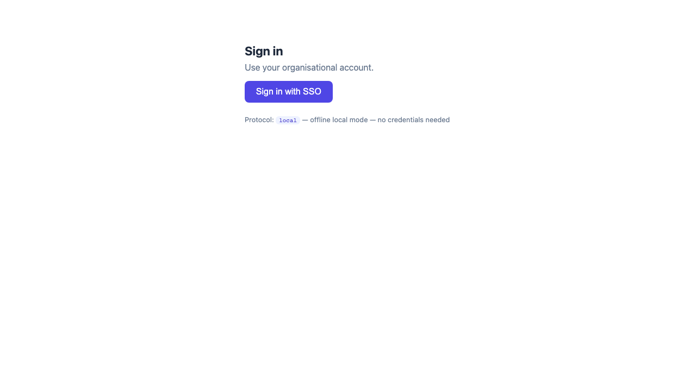
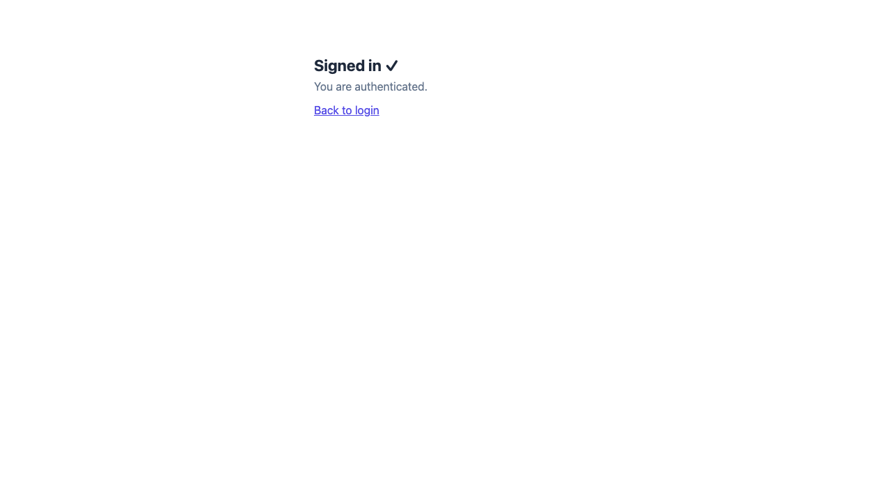
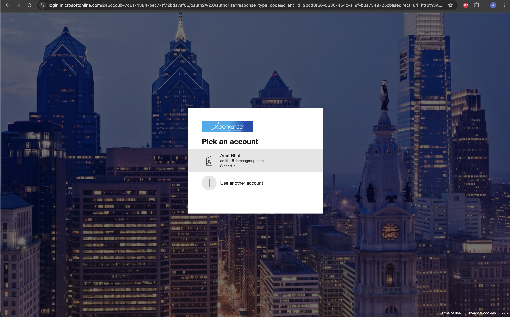

# SSO Auth — Delivery Report

_Generated by task2pr on 2026-07-07 · branch `main`_

## Task

Build a sso auth demo app with minimal UI/html that can use azure ad for authentication, use port 3001.

## Acceptance criteria

| # | Criterion | Result |
|---|-----------|--------|
| 1 | Login trigger redirects to the configured authorization endpoint | ✅ |
| 2 | Callback validates the authorization code before creating a session | ✅ |
| 3 | Successful sign-in issues an HttpOnly/Secure/SameSite session cookie | ✅ |
| 4 | Invalid / missing codes are rejected with a generic error (no raw code leaked) | ✅ |
| 5 | All external values come from `loadConfig()` — no hardcoded IdP URLs or vendor names in `src/` | ✅ |
| 6 | Auth logic branches on `auth.protocol` (`local` \| `oidc`), never on vendor names | ✅ |
| 7 | Runnable demo on **port 3001** with minimal HTML (login → dashboard) | ✅ |
| 8 | `.env` is loaded by the dev script (`--env-file`) and gitignored | ✅ |

## Tests

PASS — 19/19 (`vitest run`), 3 test files. `tsc --noEmit` and `eslint` clean.

## Local verification

PASS (offline) / SKIP_MANUAL (live OIDC). Smoke test on port 3001:

```
env-load (dev has --env-file) : PASS
landing /                     : 200
callback valid (local mode)   : 302 → /dashboard
callback invalid              : 400
callback missing              : 400
dashboard /dashboard          : 200
```

Live Azure AD sign-in requires real `.env` credentials → manual step after filling `.env`.

## Screenshots

Captured in offline `local` mode (no credentials rendered):


 (Local mode)
 (OIDC enabled)

## Files changed

- `config.json` — non-secret demo + auth settings (port 3001, Azure AD OIDC endpoint templates)
- `.env.example` — env var template (tenant/client id/secret, git remote)
- `src/config/loadConfig.ts` — runtime config reader with `${VAR}` expansion
- `src/lib/auth/sso.ts` — `initiateAuth` + `validateAuthCallback`, branches on `local`/`oidc`
- `src/lib/auth/session.ts` — secure session cookie builder
- `src/lib/auth/logger.ts` — structured failure logger (no PII)
- `src/api/auth/callback.ts` — `handleAuthCallback` HTTP handler
- `src/components/auth/LoginButton.tsx` — SSO login trigger component
- `src/demo/server.ts` — minimal-HTML demo server on port 3001
- `src/**/*.test.ts` — unit tests for sso, callback, session
- `README.md` — local + Azure AD run instructions

## Config keys added

- `config.json` — `demo.{enabled,port,baseUrl}`, `auth.{protocol,callbackPath,scopes,authorizationEndpoint,tokenEndpoint,jwksUri,issuer,session.{cookieName,ttlSeconds}}`
- `.env` — `AUTH_TENANT_ID`, `AUTH_CLIENT_ID`, `AUTH_CLIENT_SECRET`, `GIT_REMOTE` (user fills)

## Gate result

PASS in 1 cycle (one fix applied: removed a hardcoded vendor label from the demo view).
